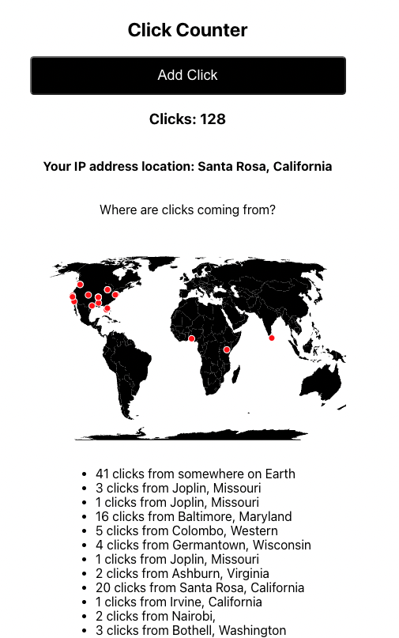

<!-- PROJECT LOGO -->
 

<h3 align="center">Click Counter with Geolocation</h3>

<!-- ABOUT THE PROJECT -->
## About The Project

As part of a 5 part application process for an internship (yes 5 rounds...) the first round required creating a click counter. The requirements were that everytime a button was clicked the number counter would increment. In addition, all previous clicks must be remembered so page refresh does not clear the count back to zero. As extra credit, you could also show where people are who have clicked the button.

This ultimately requires a website to host the application, a server to remember clicks, and optionally some APIs that would determine you coordinates on Earth.

### Built With
For this mini-project I wanted a quick and simple way to deploy everything to a live webpage, and knew that I would eventually discontinue it once the review process had ended. I used AWS Amplify to provide all the hosting and deployment with just a few simple CLI commands. This allowed me to spend more time on the project and less on the hosting setup.

React is the primary framework, along with a GraphQL server that is easily automated via Amplify. Determining a visitor's location required a free API key to a service called ipgeolocation.io. With coordinates from ipgeolocation, markers were placed onto a map using create-react-map and a free map tile from https://github.com/deldersveld/topojson.

